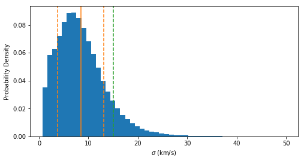

# A Galaxy Lacking Dark Matter (?)

The code in this [notebook](https://github.com/pmplewa/NGC1052-DF2/blob/master/main.ipynb) reproduces an estimate for the velocity dispersion of the ultra-diffuse galaxy NGC1052–DF2 presented in a paper by [van Dokkum et al. (2018)](https://arxiv.org/abs/1803.10237), and checks that result using a different technique (as [suggested by N. Martin](https://twitter.com/nfmartin1980/status/982245161735372804) and others).

